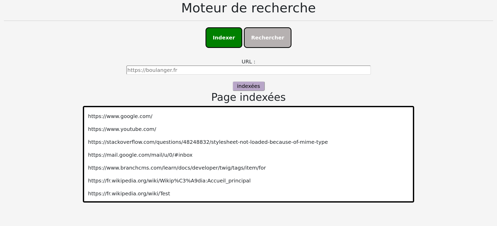

# Site Indexing Project

This project was undertaken as part of my training program. It is my first Node.js website, created using Bootstrap, JavaScript, HTML, and CSS. The purpose of the site is to index words found on a website and count their frequency of occurrence, allowing users to search for how many times a given word appears on the site and in which page it appears most frequently.

## Features

The site includes the following features:

- **Indexing Page**: A page for indexing websites by specifying the URL. Indexed words are stored in a JSON file after processing.
- **Search Page**: A page where users can search for a specific word and see how many times it appears on indexed sites using the JSON file.

## How to Launch the Site

To launch the site, follow these steps:

1. Clone the GitHub repository to your computer.

2. Run `npm install` to add dependencies.

3. Run `npm start` to launch the site.

4. Open the URL [http://localhost:8082/](http://localhost:8082/) in your browser to access the site.

Enjoy exploring and using the Site Indexing Project!
